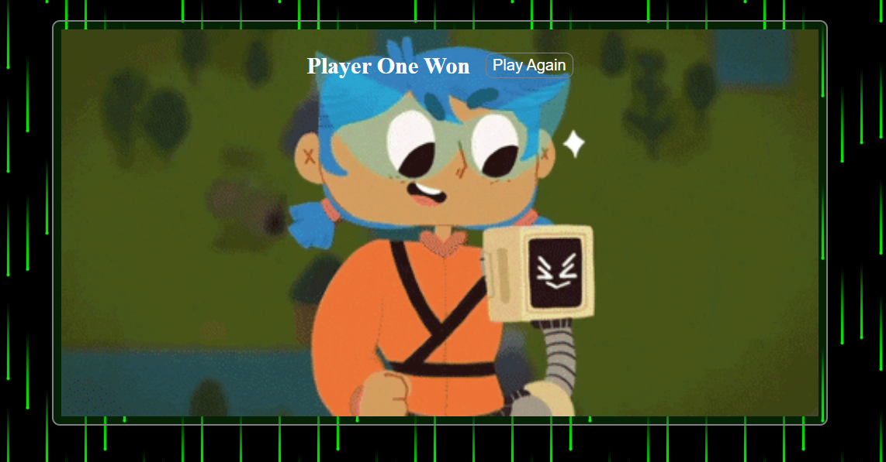

# Guess It! 🎮 
*A minimalist number guessing game built with vanilla JavaScript, HTML, and CSS.*

  (./Screenshot_2.png)    

## 🎯 **How It Works**
1. **Player 1** enters a secret number (1-10)  
2. **Player 2** has 5 attempts to guess it  
3. **Instant feedback** after each guess ("Input Should be from 0 to 10") until the correct number is found. 
4. **Winning triggers different celebrations GIF** based on the victorious player   

## 🛠️ **Actual Tech Stack** (Confirmed from Code)
- **Frontend**: Pure JavaScript (no frameworks)
- **UI**: HTML5 + CSS3
- **Logic**: DOM manipulation
- **Deployment**: wii add this later

## ✅ **Real Features**
1. **Input Validation**: Only accepts numbers 1-10   
3. **Attempt Counter**: Tracks guesses used  
4. **Win Detection**: Celebrates answers based on the users 
5. **Reset Button**: One-click replay  

## 🎮 **How to Play** (From index.html)
1. Clone/download the repo
2. Open `index.html` in any browser
3. Guess numbers until you find the secret number!
4. Click "Play Again" to reset.

## 💻 **Run Locally**
```bash
git clone https://github.com/RobiMankhinStart/Guess_it.git
cd Guess_it
# Open index.html in your browser
🔧 Customize
Want to change the number range? Edit in script.js:

